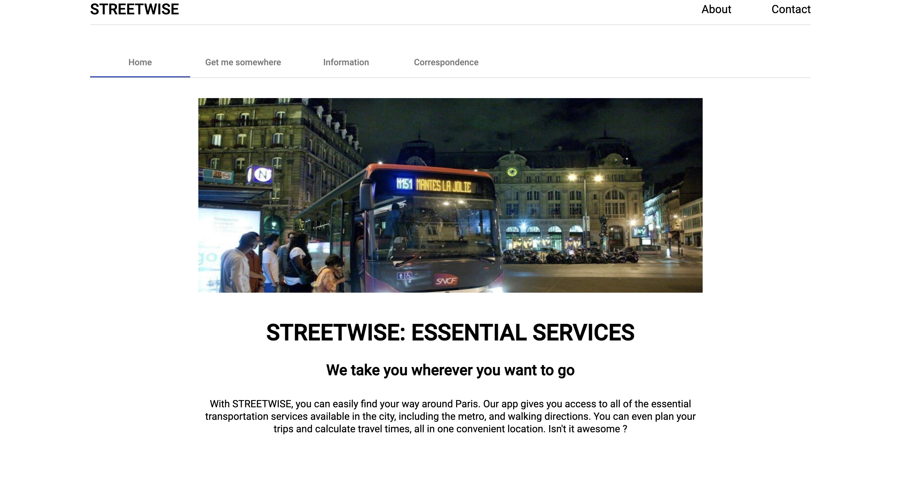
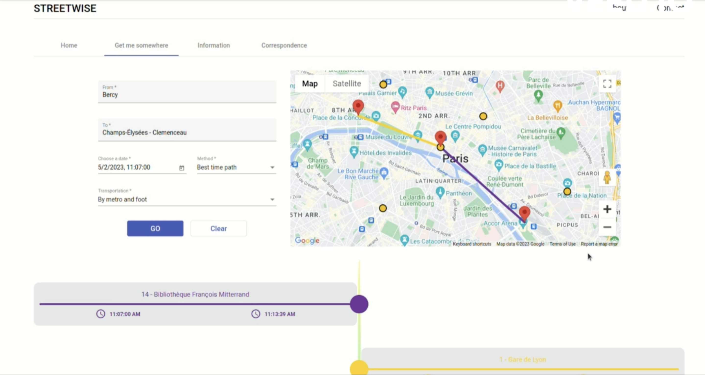
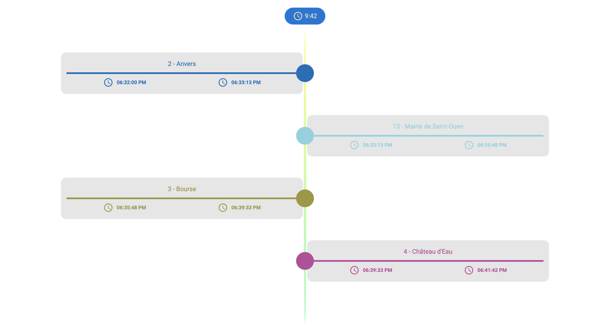

<h3 align="center">MetroMap</h3>

<!-- TABLE OF CONTENTS -->
<details>
  <summary>Table of Contents</summary>
  <ol>
    <li>
      <a href="#about-the-project">About The Project</a>
      <ul>
        <li><a href="#built-with">Built With</a></li>
      </ul>
    </li>
    <li>
      <a href="#getting-started">Getting Started</a>
      <ul>
        <li><a href="#prerequisites">Prerequisites</a></li>
        <li><a href="#installation">Installation</a></li>
      </ul>
    </li>
    <li><a href="#usage">Usage</a></li>
    <li><a href="#contact">Contact</a></li>
  </ol>
</details>


<!-- ABOUT THE PROJECT -->
## About The Project

[](documents/screenshots/homepage-screenshot.png)

Here is my public transportation navigation project, which enables users to obtain the best route 
based on their various needs, along with information about Parisian metro lines and connections.

<p align="right">(<a href="#readme-top">back to top</a>)</p>


### Built With


* [![Angular][Angular.io]][Angular-url]
* [![SpringBoot][Spring.io]][Spring-url]
* [![Maven][Maven.com]][Maven-url]
* [![JUnit][JUnit.com]][JUnit-url]
* [![Npm][Npm.com]][Npm-url]

<p align="right">(<a href="#readme-top">back to top</a>)</p>


<!-- GETTING STARTED -->
## Getting Started

### Prerequisites

This is an example of how to list things you need to use the software and how to install them.
* npm
  ```sh
  npm install npm@latest -g
  ```

### Installation

Configure project
```sh
# Java
sudo apt install openjdk-17-jdk openjdk-17-jre
# Node.js
curl -sL https://deb.nodesource.com/setup_14.x | sudo bash -
sudo apt -y install nodejs
npm install
```

Launch backend
```sh
cd backend/
./mvnw compile exec:java
```

Launch frontend
```sh
cd frontend/
npm run-script start
```

Launch test
```sh
cd backend/
./mvnw compile test
cd ../frontend/
npm run-script test
```

Generate javadoc
cd backend/
```sh
mvn javadoc:javadoc # Generate the javadoc using maven (the output is in target/site/apidocs).
```


<p align="right">(<a href="#readme-top">back to top</a>)</p>


<!-- USAGE EXAMPLES -->
## Usage


[](documents/screenshots/homepage-screenshot.png)
[](documents/screenshots/path-screenshot.png)

<!-- CONTACT -->
## Contact

Reda Meziane - reda.meziane99@gmail.com

Project Link: [https://github.com/MetroMap](https://github.com/RedaMez/MetroMap)

<p align="right">(<a href="#readme-top">back to top</a>)</p>


<!-- MARKDOWN LINKS & IMAGES -->
<!-- https://www.markdownguide.org/basic-syntax/#reference-style-links -->
[forks-shield]: https://img.shields.io/github/forks/othneildrew/Best-README-Template.svg?style=for-the-badge
[forks-url]: https://github.com/othneildrew/Best-README-Template/network/members
[stars-shield]: https://img.shields.io/github/stars/othneildrew/Best-README-Template.svg?style=for-the-badge
[stars-url]: https://github.com/othneildrew/Best-README-Template/stargazers
[issues-shield]: https://img.shields.io/github/issues/othneildrew/Best-README-Template.svg?style=for-the-badge
[issues-url]: https://github.com/othneildrew/Best-README-Template/issues
[license-shield]: https://img.shields.io/github/license/othneildrew/Best-README-Template.svg?style=for-the-badge
[license-url]: https://github.com/othneildrew/Best-README-Template/blob/master/LICENSE.txt
[linkedin-shield]: https://img.shields.io/badge/-LinkedIn-black.svg?style=for-the-badge&logo=linkedin&colorB=555
[linkedin-url]: https://linkedin.com/in/othneildrew
[product-screenshot]: images/screenshot.png
[Angular.io]: https://img.shields.io/badge/Angular-DD0031?style=for-the-badge&logo=angular&logoColor=white
[Angular-url]: https://angular.io/
[Spring.io]: https://img.shields.io/badge/Spring%20Boot-6DB33F?style=for-the-badge&logo=spring%20boot&logoColor=white
[Spring-url]: https://spring.io
[Maven.com]: https://img.shields.io/badge/Maven-C71A36?style=for-the-badge&logo=apachemaven&logoColor=white
[Maven-url]: https://apache.org
[JUnit.com]: https://img.shields.io/badge/JUnit5-25A162?style=for-the-badge&logo=junit5&logoColor=white
[JUnit-url]: https://junit.org
[Npm.com]: https://img.shields.io/badge/NPM-CB3837?style=for-the-badge&logo=npm&logoColor=white
[Npm-url]: https://npmjs.com
